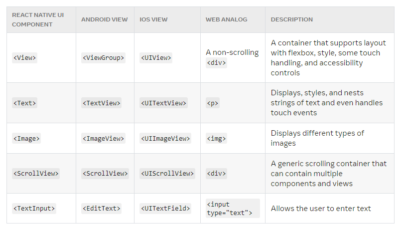

# react-native-notes

These are notes I created when learning react-native.

## Getting Started Reference:

https://reactnative.dev/docs/getting-started

## Setting Up:

The easiest way to get started is with Expo Go

```
npx create-expo-app my-project-name

```

Then, install the Expo Go app on your iOS or Android phone and connect to the same wireless network as your computer.

## Core Components and Native Components

https://reactnative.dev/docs/intro-react-native-components

"React Native is an open source framework for building Android and iOS applications using React and the app platform’s native capabilities."

### Views and mobile development

"In Android and iOS development, a view is the basic building block of UI"

### Native Components

"Because React Native components are backed by the same views as Android and iOS, React Native apps look, feel, and perform like any other apps."

### Core Components

**Usage:**

```
import {<CoreComponent>} from "react-native";

```



For more information, visit https://reactnative.dev/docs/components-and-apis.


## Handling Text Input

TextInput is a Core Component that allows the user to enter text.

It has an **onChangeText** prop that takes a function to be called every time the text changed, and an **onSubmitEditing** prop that takes a function to be called when the text is submitted.

```

const Component = () => (
      <TextInput
        style={{height: 40}}
        placeholder="Type here to translate!"
        onChangeText={newText => setText(newText)}
        defaultValue={text}
      />
)

```

## Using a ScrollView

"The ScrollView is a generic scrolling container that can contain multiple components and views."

"The ScrollView works best to present a small number of things of a limited size."

"ScrollViews can be configured to allow paging through views using swiping gestures by using the pagingEnabled props."

"Swiping horizontally between views can also be implemented on Android using the ViewPager component."

"On iOS a ScrollView with a single item can be used to allow the user to zoom content. Set up the maximumZoomScale and minimumZoomScale props and your user will be able to use pinch and expand gestures to zoom in and out."

**"If you have a long list of items which cannot fit on the screen, you should use a FlatList"**